# Poonawalla Fincorp — Agentic AI Video Loan Wizard

A working  **video-call based, agentic AI loan onboarding system**, built against the Poonawalla Fincorp problem statement 3.
A customer joins a video call with an AI agent named **Maya**, has a natural conversation about employment, income and loan purpose, gives verbal consent, and walks away with a personalised loan offer. Behind the scenes the system runs computer vision age estimation on the live video, deterministic policy + risk scoring, an LLM-style intelligence layer, and a tamper-evident audit trail in a central repository.


---


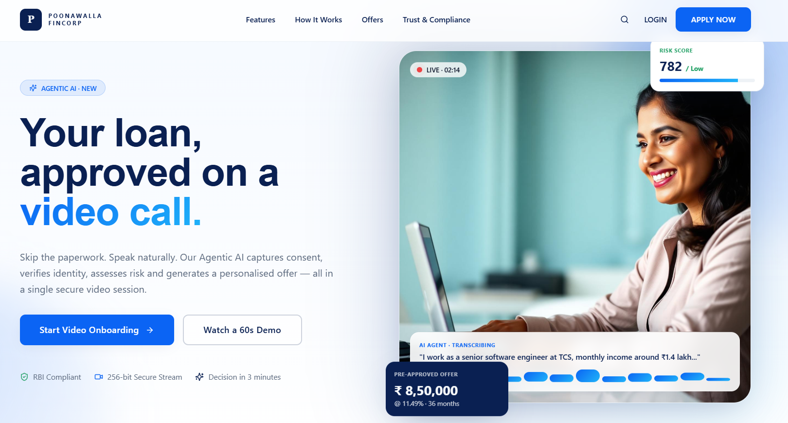
##  UI Preview

<details>
<summary>Click to view screenshots</summary>

<br>


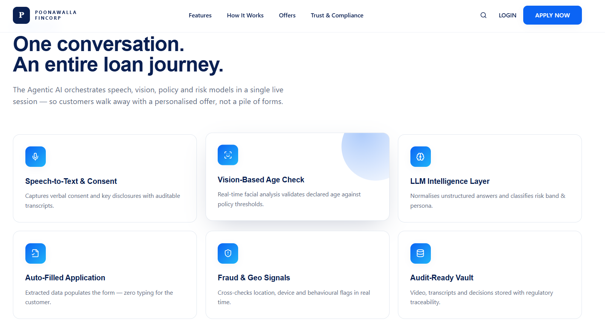
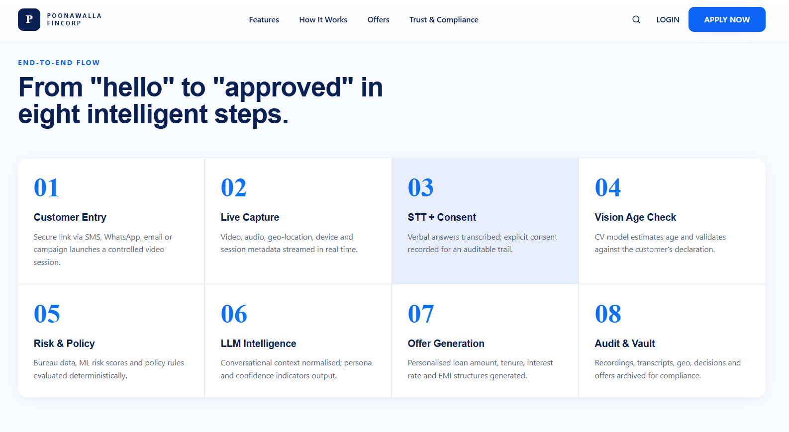
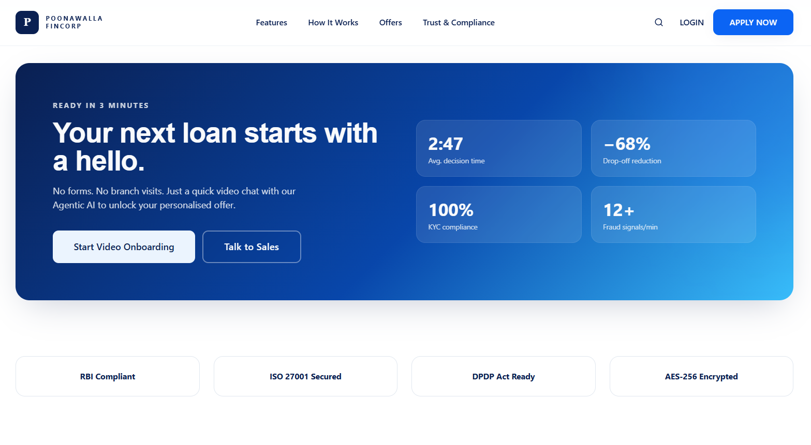

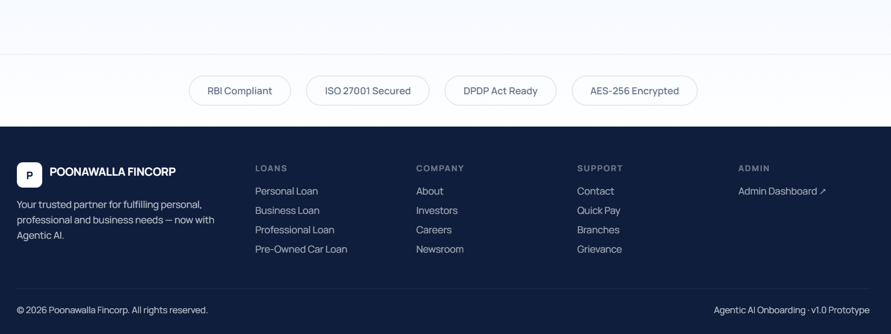
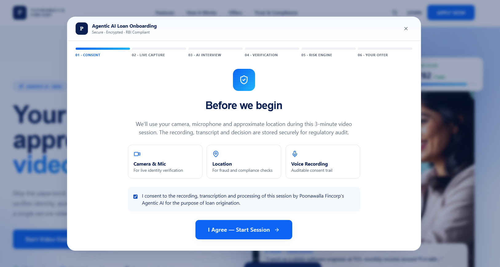
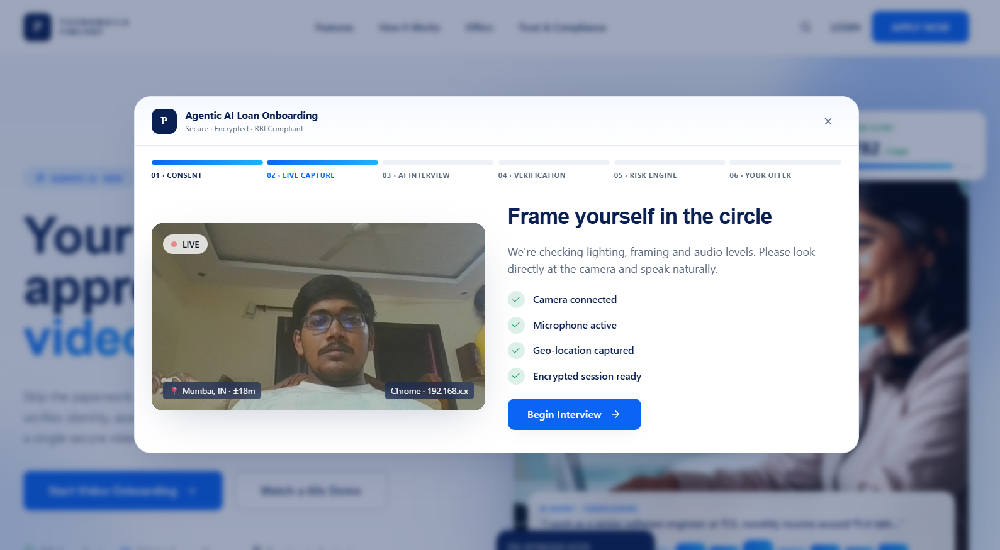
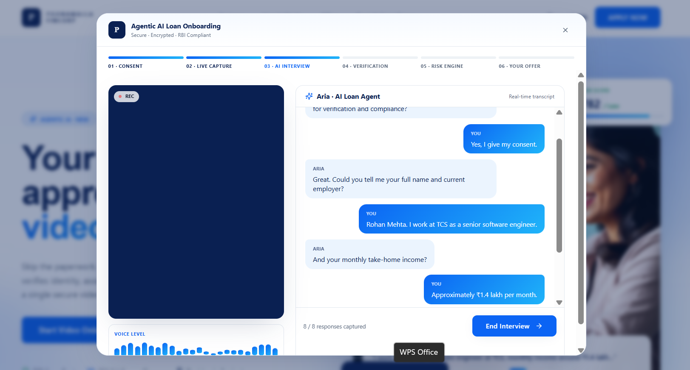


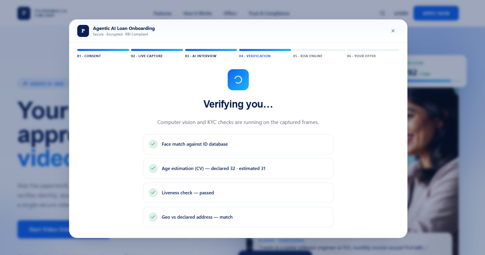
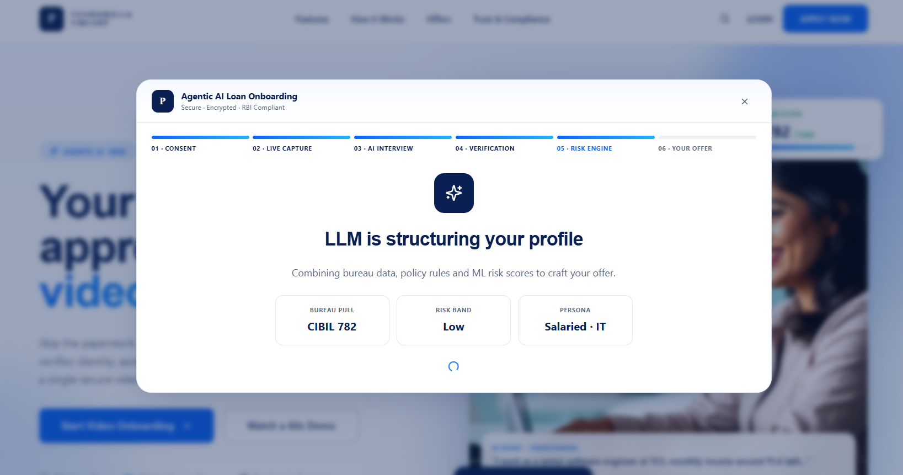
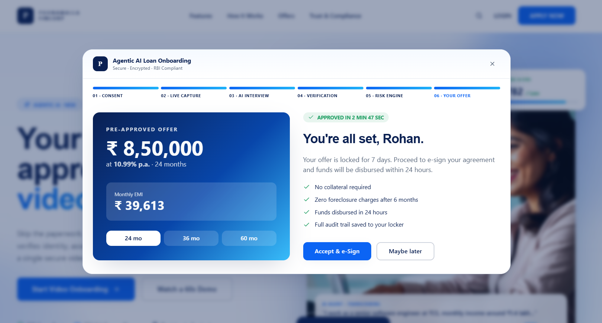
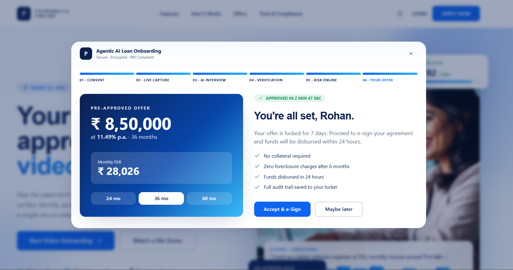

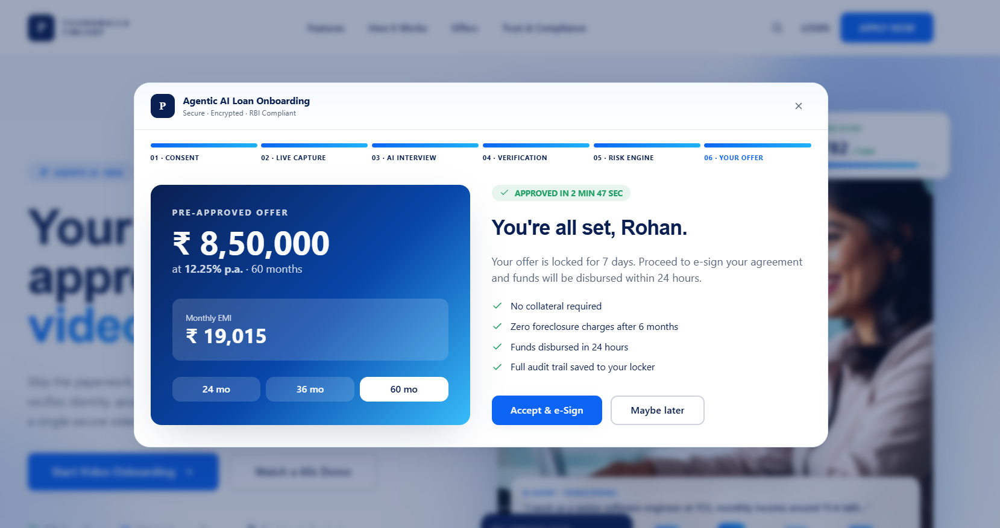
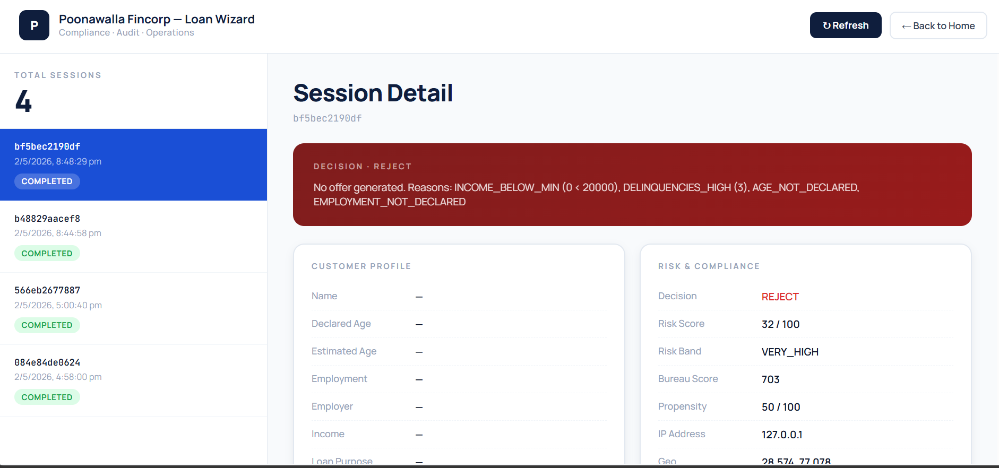
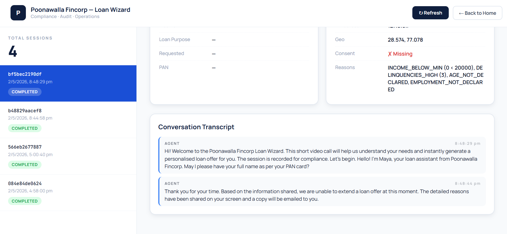


</details>


---


## What's included (mapped to the problem statement)

| Requirement | Where it lives |
|---|---|
| 2.1.1 Customer entry via secure campaign link | `frontend/index.html` landing page → `/api/session/start` |
| 2.1.2 Video + audio + geo + session metadata capture | `app.js` (getUserMedia, geolocation) → `database.py` sessions table |
| 2.1.3 STT + verbal consent capture | Browser Web Speech API → `agent.py` slot machine → `nlu.detect_consent` |
| 2.1.4 CV age estimation from video | `vision.py` (Haar cascade + texture heuristics) called every 6s |
| 2.1.5 Auto-fill forms from extracted data | `nlu.extract_all` → live "Captured Profile" panel in UI |
| 2.1.6 Risk & policy evaluation | `risk_engine.py` — bureau, FOIR, age, income, hard rules |
| 2.1.7 LLM intelligence layer (advisory, never overrides rules) | `agent.py` orchestrator — flags warnings but `risk_engine` is final |
| 2.1.8 Offer generation (amount / tenure / rate / EMI) | `risk_engine.generate_offer` — 5 tenure options, EMI maths |
| 2.1.9 Central audit / logging repository | SQLite `audit_log` + full session report at `/admin` |

---

## Architecture

```
┌─────────────────────────────┐         ┌──────────────────────────────────┐
│  Browser (Customer)         │  HTTPS  │  FastAPI Backend                 │
│  ─────────────────────────  │ ◄─────► │  ──────────────────────────────  │
│  • getUserMedia (cam + mic) │  WS     │  • /api/session/*  conversation  │
│  • Web Speech STT           │         │  • Agent state machine (Maya)    │
│  • Web Speech TTS (Maya)    │         │  • NLU slot extractor            │
│  • Geolocation              │         │  • OpenCV age + liveness         │
│  • Live transcript / fields │         │  • Risk engine + policy rules    │
│  • Frame snapshots → /age   │         │  • Offer generator (FOIR/EMI)    │
└─────────────────────────────┘         │  • SQLite audit repository       │
                                        └──────────────┬───────────────────┘
                                                       │
                                        ┌──────────────▼───────────────────┐
                                        │  Admin Dashboard (/admin)        │
                                        │  Live session list, transcripts, │
                                        │  decisions, offers, audit trail  │
                                        └──────────────────────────────────┘
```

---

## Project structure

```
loan-wizard/
├── backend/
│   ├── main.py            # FastAPI app + REST + WebSocket endpoints
│   ├── agent.py           # Maya — deterministic conversational state machine
│   ├── nlu.py             # Slot extraction (name, age, income, PAN, consent…)
│   ├── vision.py          # OpenCV age estimation + liveness check
│   ├── risk_engine.py     # Policy rules, bureau, scoring, offer generation
│   ├── database.py        # SQLite schema + audit logging helpers
│   └── requirements.txt
├── frontend/
│   ├── index.html         # Landing + consent + video call + result screens
│   ├── styles.css         # Navy / gold / cream design system
│   ├── app.js             # Camera, STT, TTS, agent loop, age capture
│   └── admin.html         # Operations dashboard
├── docs/
│   └── architecture.md    # Deeper architecture notes
├── run.sh                 # One-shot launcher (macOS / Linux)
├── run.bat                # One-shot launcher (Windows)
└── README.md
```

---

## Quick start

### Prerequisites
- **Python 3.10 or newer**
- A modern version browser like chrome
- A working webcam and microphone

### Commands for run 

```bat
cd loan-wizard
run.bat
```
Then open **http://localhost:8000** in your browser.
The admin dashboard is at **http://localhost:8000/admin**.

---

## Demo that i have checked 

When Maya greets you, speak naturally — push and hold the **mic button**, talk, then release. (You can also click **Type instead** if your environment has no mic.)

A clean approval path:

1. *"Hi Maya, my name is Priya Sharma."*
2. *"I am 32 years old."*
3. *"I work as a salaried employee at Infosys."*
4. *"My monthly income is around 95 thousand rupees."*
5. *"I want the loan for home renovation."*
6. *"I'd like to borrow 4 lakh."*
7. *"My PAN is ABCDE1234F."*  (or say *"skip"*)
8. *"Yes, I agree and give my consent."*

Maya will then say "Let me work out the best offer for you" and the **Result screen** appears with the decision badge, offer card (loan amount / tenure / interest / EMI), the five tenure options, and a plain-English explanation of every signal used.

The same conversation appears in real time on `/admin`.

---

## API surface

| Method | Path | Purpose |
|---|---|---|
| `POST` | `/api/session/start` | Begin a new session, returns `session_id` + Maya's greeting |
| `POST` | `/api/session/{sid}/geo` | Submit geolocation |
| `POST` | `/api/session/{sid}/turn` | Send one customer utterance, receive Maya's reply + extracted slots |
| `POST` | `/api/session/{sid}/age` | Submit a base64 frame, receive age estimate + liveness |
| `POST` | `/api/session/{sid}/finalize` | Run the risk engine and produce the offer |
| `GET`  | `/api/session/{sid}/report` | Full audit-grade report (JSON) |
| `GET`  | `/api/sessions` | List sessions (admin) |
| `WS`   | `/ws/session/{sid}` | Live event stream (turns, age, finalisation) |

Interactive OpenAPI docs at **http://localhost:8000/docs**.

---

## License

Prototype built for the Poonawalla Fincorp problem statement. Use freely for evaluation and extension.
